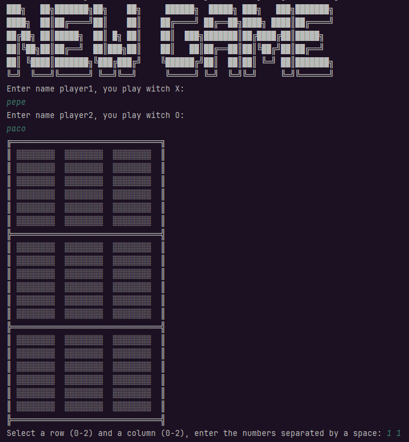
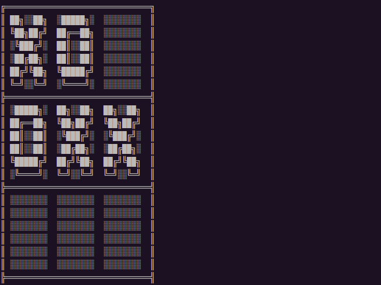
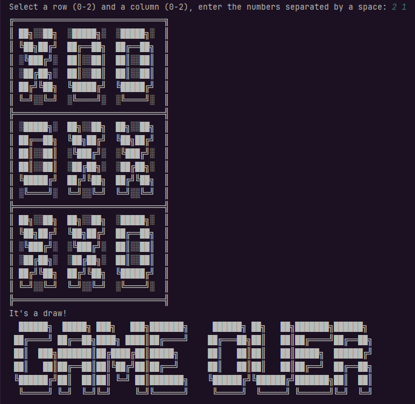

# 🎮 Tic Tac Toe (Tres en Raya) en Java

Un sencillo juego de consola **Tic Tac Toe** implementado en Java. Este proyecto demuestra principios de programación orientada a objetos, interacción por consola, y control de flujo básico.

## 📑 Índice

- [Visuales del proyecto](#-visuales-del-proyecto)
- [Características](#-características)
- [Cómo ejecutar](#-cómo-ejecutar)
- [Estructura del proyecto](#-estructura-del-proyecto)
- [Métodos principales](#-métodos-principales)
- [Tests](#-tests)
- [Equipo](#-equipo)

---
## 📸 Visuales del proyecto







---

## 🧩 Características

- Tablero visual en consola.
- Captura de movimientos por el usuario.
- Validación de jugadas (evita sobrescribir casillas).
- Alternancia entre dos jugadores.
- Control del final de la partida (victoria o empate).

---

## 🚀 Cómo ejecutar

### Requisitos

- Java 17 o superior
- Maven (opcional, si quieres construir el proyecto como un paquete)

### Clonar repositorio

```bash

git clone https://github.com/Proyecto-Tic-Tac-Toe/Tic-Tac-Toe.git
```

### Ejecución desde terminal

```bash

javac -d out $(find ./src -name "*.java")
java -cp out org.tictactoe.Main
```
### Usando Maven
```bash

mvn clean compile
mvn exec:java -Dexec.mainClass="org.tictactoe.Main"
```

---

## 📁 Estructura del proyecto

```bash

Tic-Tac-Toe/
├── src/
│   └── main/
│   │   └── java/
│   │       └── org/
│   │           └── tictactoe/
│   │               ├── Main.java          
│   │               ├── entity/
│   │                   ├── Board.java     
│   │                   └── Game.java   
│   │                   └── Player.java
│   └── test/            
│       └── java/
│            └── BoardTest.java                  
├── pom.xml                              
└── README.md
└── images/
    └── newGame.png
    └── gameProcess.png
    └── endGame.png
```

---

## 🔍 Métodos principales
- printBoard(): muestra el estado actual del tablero.

- captureNewPosition(): pide al usuario fila y columna para su jugada.

- placeNewPosition(int[] position, char player): coloca la ficha del jugador.

- checkCorrectPosition(int[] position): valida que la posición esté libre y dentro del tablero._

---


## 🧪 Tests
Si has incluido tests (por ejemplo con JUnit 5), puedes ejecutarlos con:
```bash

mvn test
```

---

## 👯‍♂️ Equipo

### [Paula Calvo](https://github.com/PCalvoGarcia)
### [Vitaliia Rubanenko](https://github.com/vitaFlash)
### [Paola Andrea](https://github.com/PaolaAPL17)
### [Ana Carina Pillajo](https://github.com/acpp2510)

